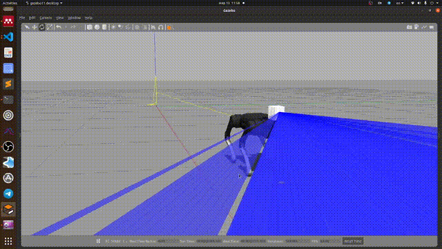

# ROS support for strelka library
A package to provide plug-in for [Livox Series LiDAR](https://www.livoxtech.com).

## Requirements
- ROS(=Melodic,Noetic)
- Gazebo (= 9.x+, http://gazebosim.org/)
- Ubuntu(=18.04,20.04)
- unitree_ros https://github.com/unitreerobotics/unitree_ros
- livox_laser_simulation (custom fork https://github.com/RumblingTurtle/livox_laser_simulation)
- strelka library (https://github.com/RumblingTurtle/strelka)

## Usage

### Start simulation
```
# With livox
roslaunch strelka_ros a1_livox.launch

# Without livox
roslaunch strelka_ros normal.launch
```
### Run low level control and state estimation

```
# Start WBIC and state estimation node together
roslaunch strelka_ros a1_wbic_observer.launch

# Or separately
roslaunch strelka_ros a1_state_estimator.launch
roslaunch strelka_ros a1_wbic.launch
```
### Start local planner node
```
roslaunch strelka_ros a1_local_planner.launch
```

## Livox mid-70 mount

