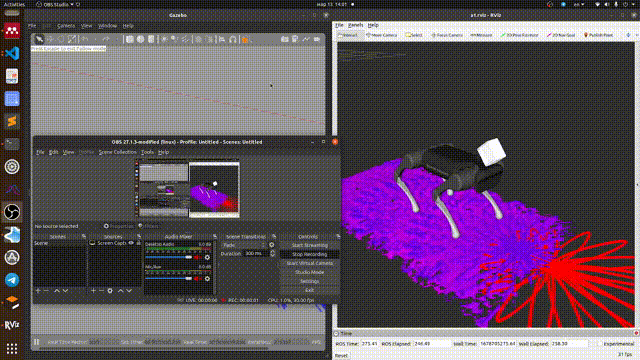

# Custom elevation_mapping filters and configs for strelka_ros

## Requirements

- strelka_ros (https://github.com/RumblingTurtle/strelka_ros)
- elevation_mapping (https://github.com/ANYbotics/elevation_mapping)

## Usage 
```
roslaunch strelka_elevation a1.launch map_type:=[stairs,steps,default]
```


