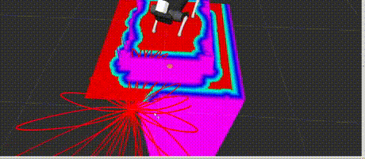

# Custom elevation_mapping filters and configs for strelka_ros

## Requirements

- strelka_ros (https://github.com/RumblingTurtle/strelka_ros)
- elevation_mapping (https://github.com/ANYbotics/elevation_mapping) 

Make sure to build catkin workspace in release mode. This will greatly improve elevation mapping processing times
```
catkin build -DCMAKE_BUILD_TYPE=Release
```

## Usage 
```
roslaunch strelka_elevation a1.launch map_type:=[stairs,steps,default]
```


