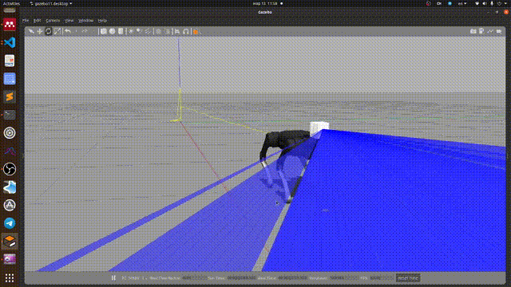

# ROS support for strelka library
A package to provide plug-in for [Livox Series LiDAR](https://www.livoxtech.com).
***
## Requirements
- ROS(=Melodic,Noetic)
- Gazebo (= 9.x+, http://gazebosim.org/)
- Ubuntu(=18.04,20.04)
- livox_laser_simulation (custom fork https://github.com/RumblingTurtle/livox_laser_simulation)
- unitree_ros https://github.com/unitreerobotics/unitree_ros
- strelka library (https://github.com/RumblingTurtle/strelka)
- grid_map

***

## Usage

### Start simulation
```
# With livox
roslaunch strelka_ros a1_livox.launch 

# Without livox
roslaunch strelka_ros a1_normal.launch

# Livox can have custom pitch value
roslaunch strelka_ros a1_livox.launch livox_pitch:=0.9

# Custom worlds can also be used
roslaunch strelka_ros [a1_normal|a1_livox].launch wname:=[empty|stairs|bumpy_terrain ...]
```
### Run everything in one go ...
```
roslaunch strelka_ros a1_full_pipeline.launch blind:=true/false perfect_odometry:=true/false
```
### ... Or
### 1. Run low level control and state estimation
```
# Start WBIC and state estimation node together
roslaunch strelka_ros a1_wbic_observer.launch perfect_odometry:=true/false

# Or separately
roslaunch strelka_ros a1_state_estimator.launch perfect_odometry:=true/false
roslaunch strelka_ros a1_wbic.launch
```
### 2. Start local planner node
```
roslaunch strelka_ros a1_local_planner.launch blind:=true/false
```
### 3. Publish high level command
```
roslaunch strelka_ros a1_high_command_publisher.launch
```
***
## Edit control parameters using yaml config
```
#config/a1_full_pipeline.yaml
    velocityX: 0.2
    velocityY: 0.0
    velocityYaw: 0.0 
    footHeight: 0.08 
    bodyHeight: 0.26 
    gait: [trot|stand|flytrot|step|pronk]
```
***
## Livox mid-70 mount

