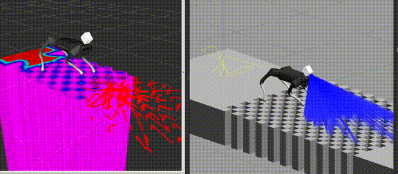

<p align="center">
  
</p>

# ROS support for strelka library
- Gazebo launch files for UnitreeA1 robot
- Livox mid-70 robot mount
- Foothold selection algorithms implemented using [grid_map](https://github.com/ANYbotics/grid_map)

## Requirements
- Ubuntu(=18.04,20.04)
- ROS(=Melodic,Noetic)
- [Gazebo](http://gazebosim.org) (= 9.x+)
- [livox_laser_simulation](https://github.com/RumblingTurtle/livox_laser_simulation) (custom fork)
- [unitree_ros](https://github.com/unitreerobotics/unitree_ros)
- [strelka](https://github.com/RumblingTurtle/strelka) library 
- [grid_map](https://github.com/ANYbotics/grid_map)

## Installation
Make sure to build your catkin workspace with optimizations. They greatly improve both elevation_mapping and foothold adaptation speeds.
```
catkin build -DCMAKE_BUILD_TYPE=Release
```
## Usage
### Start simulation
```
roslaunch strelka_ros a1_simulation.launch.launch lidar:=[true|false] lidar_pitch:=0.8 wname:=[empty|stairs|bumpy_terrain ...]
```
### Run everything in one go ...
```
roslaunch strelka_ros a1_full_pipeline.launch blind:=true/false perfect_odometry:=true/false
```
### ... Or
### 1. Run low level control and state estimation
```
# Start WBIC and state estimation node together
roslaunch strelka_ros a1_wbic_observer.launch perfect_odometry:=true/false

# Or separately
roslaunch strelka_ros a1_state_estimator.launch perfect_odometry:=true/false
roslaunch strelka_ros a1_wbic.launch
```
### 2. Start local planner node
```
roslaunch strelka_ros a1_local_planner.launch blind:=true/false
```
### 3. Publish high level command
```
roslaunch strelka_ros a1_high_command_publisher.launch
```

## Edit control parameters using yaml config
```
#config/a1_full_pipeline.yaml
    velocityX: 0.2
    velocityY: 0.0
    velocityYaw: 0.0 
    footHeight: 0.08 
    bodyHeight: 0.26 
    foothold_search_radius: 0.1 #Search radius for foothold adaptation. Not used in blind mode
    gait: [trot|stand|flytrot|step|pronk]
```